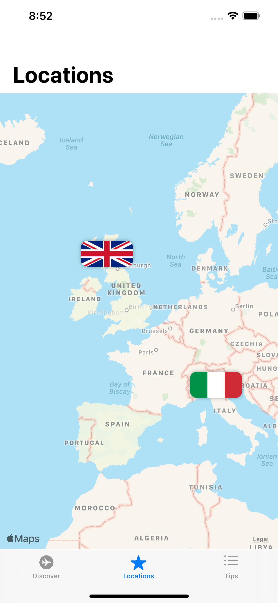
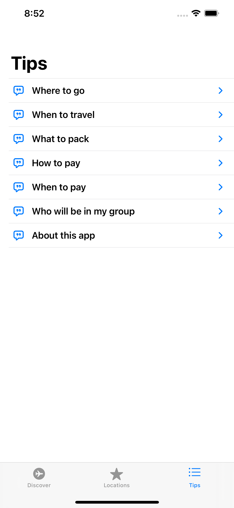

<h1 align="center">Welcome to Trekr iOS APP 👋</h1>

  

> This is a case for study to create an app for iOS system

## Author

👤 **Raí Vieira Adriano**

* Website: https://www.linkedin.com/in/raivieiraadriano/
* Github: [@raivieiraadriano92](http://github.com/raivieiraadriano92/)

## Screenshots

## Show your support

Give a ⭐️ if this project helped you!

***
_This README was generated with ❤️ by [readme-md-generator](https://github.com/kefranabg/readme-md-generator)_
